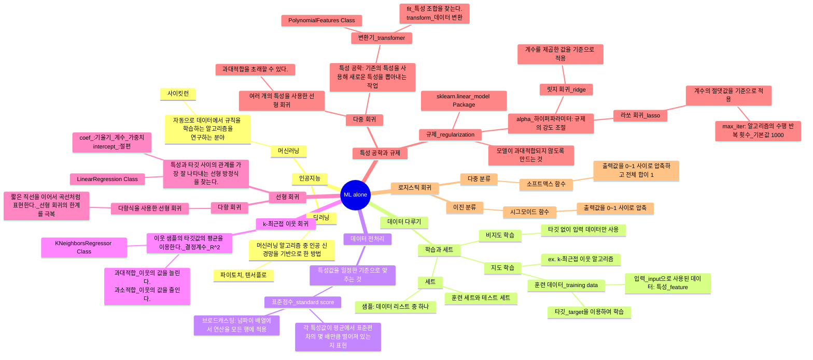

```mermaid
    mindmap
  root((ML alone))
    인공지능
      머신러닝
        자동으로 데이터에서 규칙을 학습하는 알고리즘을<br/>연구하는 분야
            사이킷런
      딥러닝
        머신러닝 알고리즘 중 인공 신경망을 기반으로 한 방법
            파이토치, 텐서플로    
    데이터 다루기
      학습과 세트
        지도 학습
            훈련 데이터_training data
                입력_input으로 사용된 데이터: 특성_feature
                타깃_target을 이용하여 학습
            ex. k-최근접 이웃 알고리즘
        비지도 학습
            타깃 없이 입력 데이터만 사용
        세트
            훈련 세트와 테스트 세트
            샘플: 데이터 리스트 중 하나
    데이터 전처리
      특성값을 일정한 기준으로 맞추는 것
        표준점수_standard score
          각 특성값이 평균에서 표준편차의 몇 배만큼 떨어져 있는지 표현
          브로드캐스팅: 넘파이 배열에서 연산을 모든 행에 적용
    k-최근접 이웃 회귀
        이웃 샘플의 타깃값의 평균을 이용한다._결정계수_R^2
            KNeighborsRegressor Class
            과대적합_이웃의 값을 늘린다.<br>과소적합_이웃의 값을 줄인다.
    선형 회귀
      특성과 타깃 사이의 관계를 가장 잘 나타내는 선형 방정식을 찾는다.
        LinearRegression Class
        coef_:기울기_계수_가중치<br>intercept_:절편
      다항 회귀
        다항식을 사용한 선형 회귀
          짧은 직선을 이어서 곡선처럼 표현한다._선형 회귀의 한계를 극복
    특성 공학과 규제
      다중 회귀
        여러 개의 특성을 사용한 선형 회귀
          과대적합을 초래할 수 있다.
        특성 공학: 기존의 특성을 사용해 새로운 특성을 뽑아내는 작업
          변환기_transfomer
            PolynomialFeatures Class
            fit_특성 조합을 찾는다.<br>transform_데이터 변환
      규제_regularization
        모델이 과대적합되지 않도록 만드는 것
        sklearn.linear_model Package
        alpha_하이퍼파라미터: 규제의 강도 조절
          릿지 회귀_ridge
            계수를 제곱한 값을 기준으로 적용
          라쏘 회귀_lasso
            계수의 절댓값을 기준으로 적용
              max_iter: 알고리즘의 수행 반복 횟수_기본값 1000
    로지스틱 회귀
      이진 분류
        시그모이드 함수
          출력값을 0~1 사이로 압축
      다중 분류
        소프트맥스 함수
          출력값을 0~1 사이로 압축하고 전체 합이 1

```
