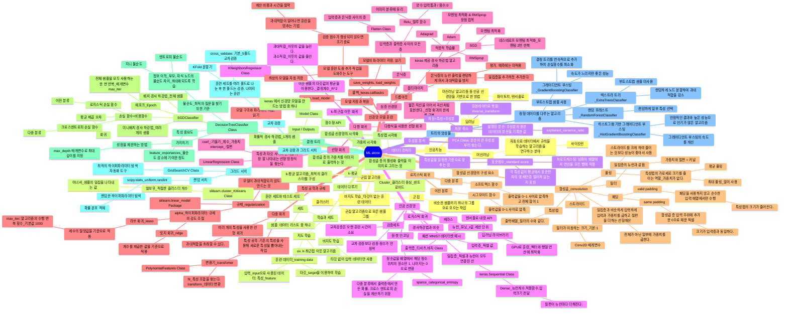

```mermaid
    mindmap
  root((ML alone))
    인공지능
      머신러닝
        자동으로 데이터에서 규칙을 학습하는 알고리즘을<br/>연구하는 분야
            사이킷런
      딥러닝
        머신러닝 알고리즘 중 인공 신경망을 기반으로 한 방법
            파이토치, 텐서플로    
    데이터 다루기
      학습과 세트
        지도 학습
            훈련 데이터_training data
                입력_input으로 사용된 데이터: 특성_feature
                타깃_target을 이용하여 학습
            ex. k-최근접 이웃 알고리즘
        비지도 학습
            타깃 없이 입력 데이터만 사용
        세트
            훈련 세트와 테스트 세트
            샘플: 데이터 리스트 중 하나
    데이터 전처리
      특성값을 일정한 기준으로 맞추는 것
        표준점수_standard score
          각 특성값이 평균에서 표준편차의 몇 배만큼 떨어져 있는지 표현
          브로드캐스팅: 넘파이 배열에서 연산을 모든 행에 적용
    k-최근접 이웃 회귀
        이웃 샘플의 타깃값의 평균을 이용한다._결정계수_R^2
            KNeighborsRegressor Class
            과대적합_이웃의 값을 늘린다.<br>과소적합_이웃의 값을 줄인다.
    선형 회귀
      특성과 타깃 사이의 관계를 가장 잘 나타내는 선형 방정식을 찾는다.
        LinearRegression Class
        coef_:기울기_계수_가중치<br>intercept_:절편
      다항 회귀
        다항식을 사용한 선형 회귀
          짧은 직선을 이어서 곡선처럼 표현한다._선형 회귀의 한계를 극복
    특성 공학과 규제
      다중 회귀
        여러 개의 특성을 사용한 선형 회귀
          과대적합을 초래할 수 있다.
        특성 공학: 기존의 특성을 사용해 새로운 특성을 뽑아내는 작업
          변환기_transfomer
            PolynomialFeatures Class
            fit_특성 조합을 찾는다.<br>transform_데이터 변환
      규제_regularization
        모델이 과대적합되지 않도록 만드는 것
        sklearn.linear_model Package
        alpha_하이퍼파라미터: 규제의 강도 조절
          릿지 회귀_ridge
            계수를 제곱한 값을 기준으로 적용
          라쏘 회귀_lasso
            계수의 절댓값을 기준으로 적용
              max_iter: 알고리즘의 수행 반복 횟수_기본값 1000
    로지스틱 회귀
      이진 분류
        시그모이드 함수
          출력값을 0~1 사이로 압축
      다중 분류
        소프트맥스 함수
          출력값을 0~1 사이로 압축하고 전체 합이 1
    확률적 경사 하강법_1개의 샘플
      SGDClassifier
        미니배치 경사 하강법_여러 개의 샘플
        배치 경사 하강법_전체 샘플
        손실 함수=비용함수
          로지스틱 손실 함수
            이진 분류
          크로스엔트로피 손실 함수
            다중 분류
          평균 제곱 오차
            회귀
        에포크_Epoch
          전체 샘플을 모두 사용하는 한 번 반복_매개변수 max_iter
    결정 트리
      DecisionTreeClassfier Class
        불순도_최적의 질문을 찾기 위한 기준
          정보 이득_부모, 자식 노드의 불순도 차이_최대화되도록 학습
            지니 불순도
            엔트로피 불순도
        가지치기
          성장을 제한하는 방법
            max_depth 매개변수로 최대 깊이를 지정
        특성 중요도
          feature_importances_불순도 감소에 기여한 정도
    교차 검증과 그리드 서치
      교차 검증
        훈련 세트를 여러 폴드로 나눈 후 한 폴드는 검증, 나머지는 훈련
          cross_validate: 기본_5폴드교차검증
          KFold 분할기
      그리드 서치
        GridSearchCV Class
          최적의 하이퍼파라미터 탐색 자동화 도구
        랜덤 서치
          scipy.stats_uniform,randint
            랜덤한 하이퍼파라미터 탐색
              확률 분포 객체
    트리의 앙상블
      정형 데이터를 다루는 알고리즘
        랜덤 포레스트_RandomForestClassifier
          부트스트랩 샘플 사용
          랜덤하게 일부 특성 선택
        엑스트라 트리_ExtraTreesClassifier
          부트스트랩 샘플 미사용
          랜덤하게 노드 분할하여 과대적합을 감소
        그레이디언트 부스팅_GradientBoostingClassifier
          결정 트리를 연속적으로 추가하여 손실함수를 최소화
          속도가 느리지만 좋은 성능
        히스토그램 기반 그레이디언트 부스팅_HistGradientBoostingClassifier
          그레이디언트 부스팅의 속도를 개선
          안정적인 결과와 높은 성능으로 인기가 많은 알고리즘
    군집 알고리즘
      비지도 학습_타깃이 없는 훈련 데이터
        군집
          비슷한 샘플끼리 하나의 그룹으로 모으는 작업
        클러스터
          군집 알고리즘으로 모은 샘플 그룹
    k-평균
      Cluster_클러스터 중심_센트로이드
      k-평균 알고리즘_최적의 클러스터를 구성
        sklearn.cluster_KMeans Class
          엘보우_적절한 클러스터 개수
            이너셔_샘플의 밀집을 나타내는 값
    주성분 분석
      PCA Class: 분산이 큰 주성분부터 찾는다. 
      차원 축소
        차원=특성=주성분
        설명된 분산: 주성분의 원본 데이터의 분산을 기록한 값
          explained_variance_ratio
        원본데이터로 복원: inverse_transform
    인공 신경망
      로지스틱 회귀
        경사하강법과 비슷
      패션 MNIST 데이터셋 예시
        출력층_티셔츠,바지 Class
        뉴런_유닛_z값 계산 단위
        입력층_픽셀 값
        밀집층_픽셀과 뉴런이 모두 연결된 선
          keras.Sequential Class
            Dense_뉴런개수,적용함수,입력크기 전달
              절편이 뉴런마다 더해진다.
      케라스
        딥러닝 라이브러리
          GPU로 훈련_벡터와 행렬 연산에 최적화
          텐서플로 내장 API
      검증세트
        교차 검증보다 검증 점수가 안정적
        교차검증은 오랜 훈련 시간이 소요
      원-핫 인코딩
        정숫값을 배열에서 해당 정수 위치의 원소만 1, 나머지는 0으로 변환
          다중 분류에서 출력층에서 만든 확률, 크로스 엔트로피 손실을 계산하기 위함
          sparce_categorical_entropy
    심층 신경망
      은닉층
        입력층과 출력층 사이의 모든 층
          Relu_렐루 함수
            이미지 분류에 유리
            양수:입력통과 / 음수:0
          Flatten Class
            입력층과 은닉층 사이의 층
      옵티마이저  
        keras 제공 경사 하강법 알고리즘
          SGD
            모멘텀 최적화
            네스테로프 모멘텀 최적화_모멘텀 2번 반복
          적응적 학습률
            Adagrad
            RMSprop
          Adam
            모멘텀 최적화 & RMSprop 장점 접목
    신경망 모델 훈련
      드롭아웃
        은닉층의 뉴런 출력을 랜덤하게 꺼서 과대적합을 방지
          평가, 예측에는 미적용
          밀집층을 추가하듯 추가한다.
      모델 저장과 복원
        save_weights, load_weights
          모델의 파라미터 저장, 읽기
        save, load_model
          모델 구조와 파라미터 저장, 읽기
      콜백_keras.callbacks
        모델 훈련 도중 추가 작업을 도와주는 도구
          최상의 모델을 자동 저장
          검증 점수가 향상되지 않으면 조기 종료
            과대적합이 일어나면 훈련을 멈추는 기법
              계산 비용과 시간을 절약
    합성곱 신경망의 구성 요소
      합성곱_convolution
        밀집층과 비슷하게 입력하게 입력과 가중치를 곱하고 절편을 더하는 선형계산
          전체가 아닌 일부에 가중치를 곱한다.
        필터
          밀집층의 뉴런과 같음
            가중치와 절편 = 커널
        특성맵
          출력배열_필터의 수와 같다.
        패딩
          valid padding
            패딩을 사용하지 않고 순수한 입력 배열에서만 수행
              특성맵의 크기가 줄어든다.
          same padding
            합성곱 층 입력 주위에 추가한 0으로 채운 픽셀
              크기가 입력층과 동일하다.
        스트라이드
          필터가 이동하는 크기_기본:1
            Conv2D 매개변수
        풀링
          스트라이드를 크게 하여 줄이는 것보다 성능이 좋아서 사용
          특성맵의 가로세로 크기를 줄이는 역할_가중치가 없다.
            최대 풀링_많이 사용
            평균 풀링
    합성곱 신경망의 시각화
      가중치 시각화
        합성곱 층의 가중치를 이미지로 출력하는 것
      특성맵 시각화
        합성곱 층의 활성화 출력을 이미지로 그리는 것
      함수형 API
        keras 에서 신경망 모델을 만드는 방법 중 하나
          Model Class
            Input / Outputs
```
